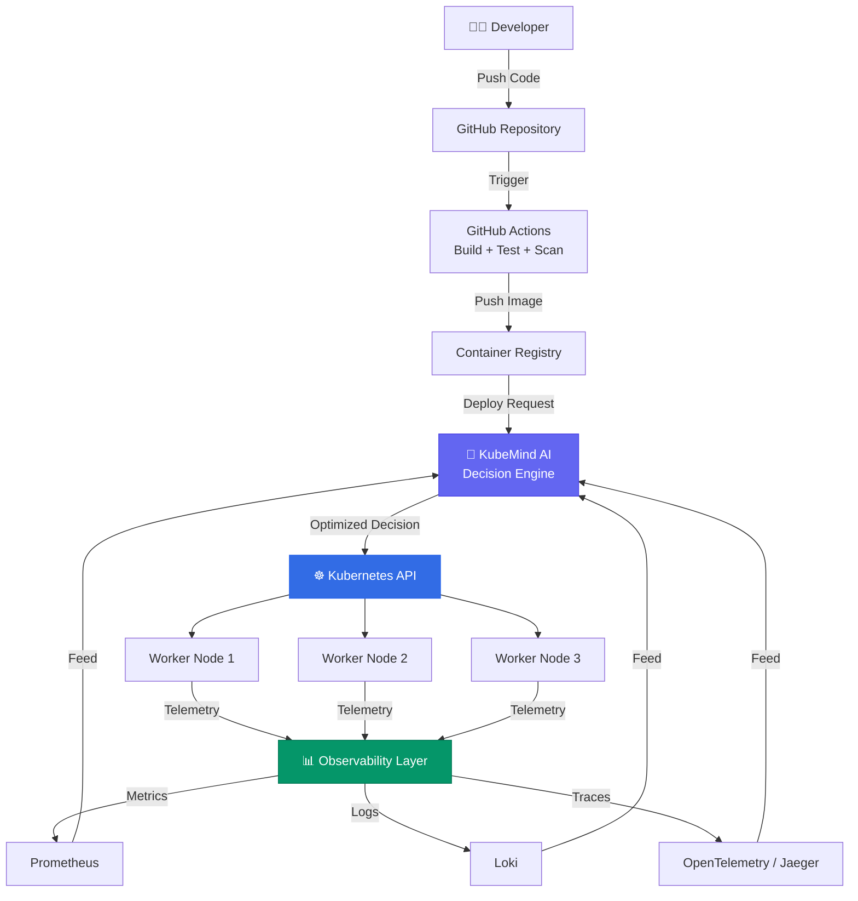
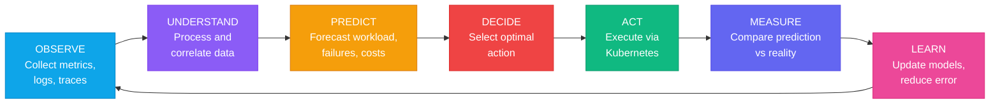
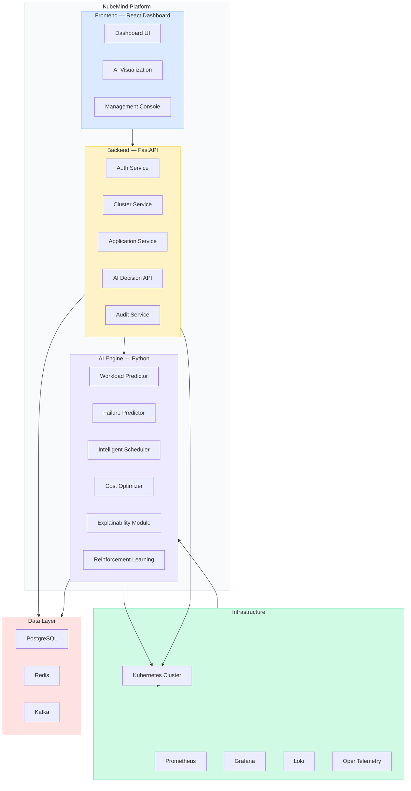
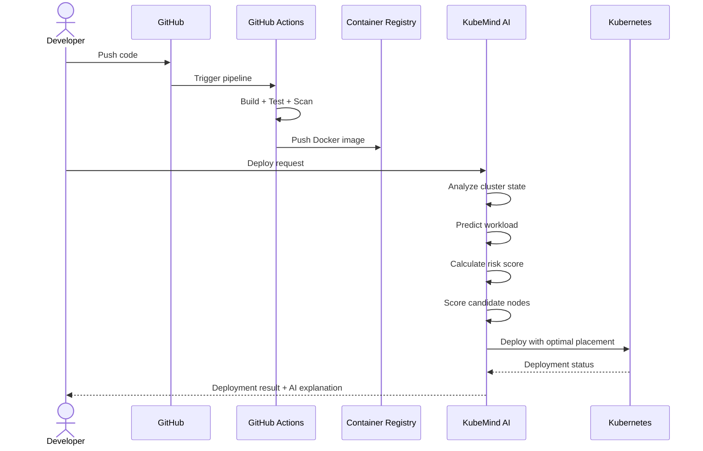
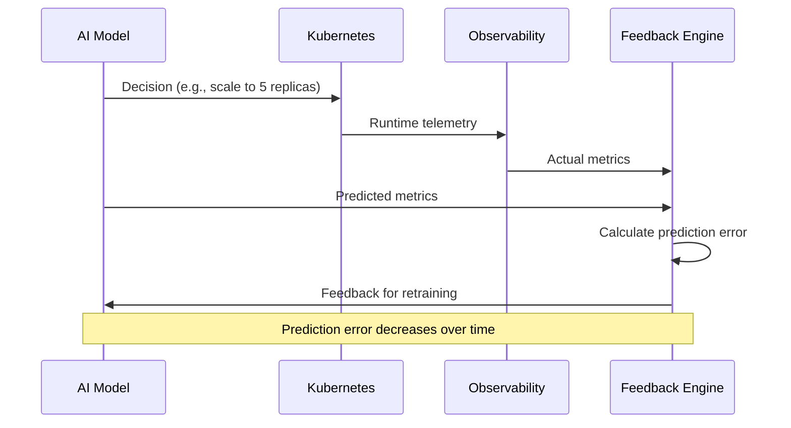
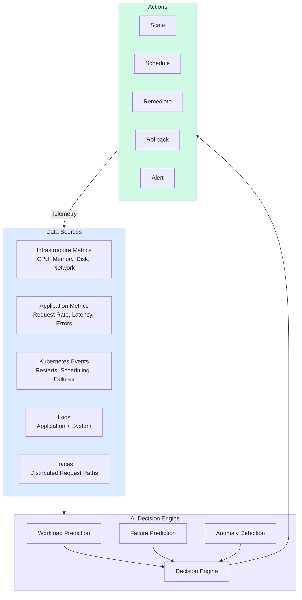

# KubeMind — Architecture Overview

## System Context

KubeMind sits as an **AI decision layer** between developers/operators and the Kubernetes execution layer. It transforms the standard reactive Kubernetes workflow into an intelligent, predictive loop.



---

## Core Decision Loop

KubeMind operates on a continuous intelligence loop:



---

## Component Architecture

### Platform Layer



---

## Data Flow

### Deployment Flow



### Feedback Loop



---

## Module Interaction Map



---

## Deployment Topology

### Local Development

```
Windows Host
│
├── Docker Desktop
│   ├── PostgreSQL (port 5432)
│   ├── Redis (port 6379)
│   └── Kafka (port 9092)
│
└── WSL2 Ubuntu
    ├── Kind Cluster
    │   ├── Control Plane
    │   ├── Worker Node 1
    │   ├── Worker Node 2
    │   └── Worker Node 3
    │
    ├── Backend (FastAPI — port 8000)
    └── Frontend (Vite — port 5173)
```

### Production (Future)

```
Cloud Provider (EKS / GKE / AKS)
│
├── KubeMind Namespace
│   ├── Backend Pods
│   ├── AI Engine Pods
│   └── Frontend Pods (Nginx)
│
├── Application Namespace
│   ├── Microservice Pods
│   └── Database Pods
│
├── Monitoring Namespace
│   ├── Prometheus
│   ├── Grafana
│   ├── Loki
│   └── Jaeger
│
└── GitOps
    └── Argo CD
```

---

## Key Design Principles

1. **Kubernetes remains the execution layer** — KubeMind never replaces K8s, it enhances it.
2. **AI decisions are explainable** — Every decision includes inputs, reasoning, confidence.
3. **Feedback drives improvement** — Prediction vs reality is always measured.
4. **Start simple, grow complex** — Linear Regression before Reinforcement Learning.
5. **Real data over synthetic** — Collect actual telemetry whenever possible.
6. **Modular architecture** — Each AI module is independently deployable and testable.
