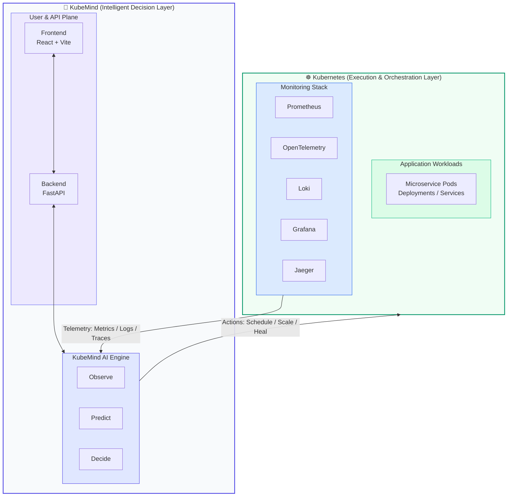
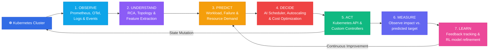
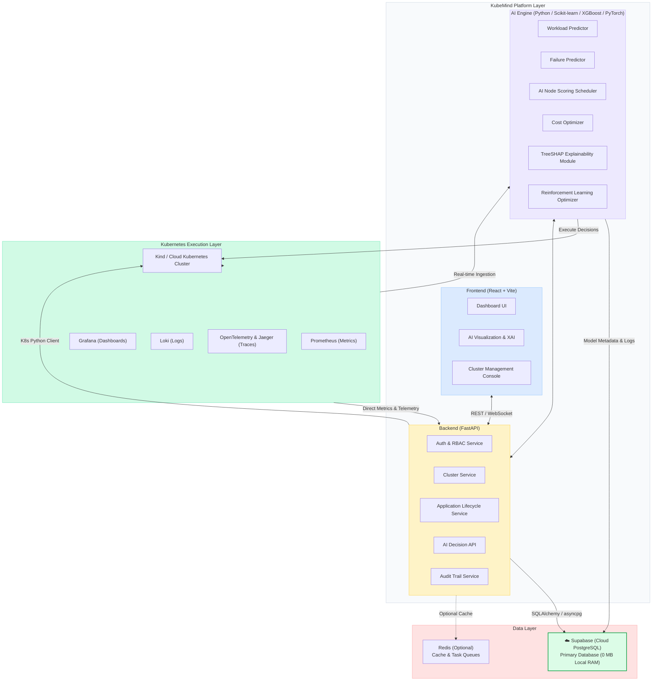

# KubeMind — Architecture Overview

## 1. Overall System Architecture & Hierarchy

KubeMind is an **autonomous AI-powered Kubernetes cloud operations platform**. It sits strictly **above** Kubernetes as an intelligent decision and control layer.

Kubernetes remains the execution and orchestration layer, while KubeMind provides observation, predictive analytics, intelligent scheduling, autoscaling, and remediation decisions.

```
                    KubeMind
                       │
          ┌────────────┴────────────┐
          │                         │
       Frontend                 Backend
       React/Vite               FastAPI
          │                         │
          └────────────┬────────────┘
                       │
                KubeMind AI Engine
                       │
          ┌────────────┼────────────┐
          │            │            │
       Observe       Predict      Decide
          │            │            │
          └────────────┼────────────┘
                       │
                       ▼
                  Kubernetes
                       │
              ┌────────┴────────┐
              │                 │
          Application       Monitoring
           Workloads          Stack
```


```mermaid
graph TB
    subgraph KM["🧠 KubeMind (Intelligent Decision Layer)"]
        direction TB
        subgraph KM_CORE["User & API Plane"]
            FE["Frontend<br/>React + Vite"]
            BE["Backend<br/>FastAPI"]
        end
        subgraph KM_AI["KubeMind AI Engine"]
            OBS_M["Observe"]
            PRED_M["Predict"]
            DEC_M["Decide"]
        end
        FE <--> BE
        BE <--> KM_AI
    end

    subgraph K8S["☸️ Kubernetes (Execution & Orchestration Layer)"]
        direction TB
        subgraph APP["Application Workloads"]
            PODS["Microservice Pods<br/>Deployments / Services"]
        end
        subgraph MON["Monitoring Stack"]
            PROM["Prometheus"]
            OTEL["OpenTelemetry"]
            LOKI["Loki"]
            GRAF["Grafana"]
            JAEGER["Jaeger"]
        end
    end

    KM_AI -->|Actions: Schedule / Scale / Heal| K8S
    MON -->|Telemetry: Metrics / Logs / Traces| KM_AI

    style KM fill:#f8fafc,stroke:#4f46e5,stroke-width:2px
    style KM_CORE fill:#ede9fe,stroke:#6366f1
    style KM_AI fill:#e0e7ff,stroke:#4f46e5
    style K8S fill:#f0fdf4,stroke:#059669,stroke-width:2px
    style APP fill:#dcfce7,stroke:#10b981
    style MON fill:#dbeafe,stroke:#2563eb
```

---

## 2. The KubeMind Closed-Loop Intelligence Flow

KubeMind is not simply a passive monitoring dashboard for Kubernetes. It operates as an **autonomous, closed-loop decision engine** that continuously observes cluster telemetry, understands anomalies, predicts future trajectory, acts through Kubernetes APIs, and learns from results:

```
Kubernetes
    │
    ▼
Observe
(Prometheus / OpenTelemetry / Logs / Events)
    │
    ▼
Understand
(RCA / Feature Extraction)
    │
    ▼
Predict
(Workload / Failure / Resource Demand)
    │
    ▼
Decide
(AI Scheduler / Autoscaling / Optimization)
    │
    ▼
Act
(Kubernetes API / Controllers)
    │
    ▼
Measure
    │
    ▼
Learn
(Feedback / RL)
    │
    └──────────────► Improve AI Engine
```


```mermaid
graph LR
    K8S["☸️ Kubernetes Cluster"] --> A["1. OBSERVE<br/>Prometheus, OTel,<br/>Logs & Events"]
    A --> B["2. UNDERSTAND<br/>RCA, Topology &<br/>Feature Extraction"]
    B --> C["3. PREDICT<br/>Workload, Failure &<br/>Resource Demand"]
    C --> D["4. DECIDE<br/>AI Scheduler, Autoscaling<br/>& Cost Optimization"]
    D --> E["5. ACT<br/>Kubernetes API &<br/>Custom Controllers"]
    E --> F["6. MEASURE<br/>Observe impact vs.<br/>predicted target"]
    F --> G["7. LEARN<br/>Feedback tracking &<br/>RL model refinement"]
    G -->|Continuous Improvement| C
    E -->|State Mutation| K8S

    style K8S fill:#326ce5,stroke:#1d4ed8,color:#fff
    style A fill:#0ea5e9,stroke:#0284c7,color:#fff
    style B fill:#8b5cf6,stroke:#7c3aed,color:#fff
    style C fill:#f59e0b,stroke:#d97706,color:#fff
    style D fill:#ef4444,stroke:#dc2626,color:#fff
    style E fill:#10b981,stroke:#059669,color:#fff
    style F fill:#6366f1,stroke:#4f46e5,color:#fff
    style G fill:#ec4899,stroke:#db2777,color:#fff
```

### Compromise in Telemetry Pipeline
Previous drafts included Apache Kafka for event streaming. In KubeMind, Kafka was removed to eliminate unnecessary overhead and JVM memory footprint (1+ GB). 

Telemetry streams directly through:
$$\text{Kubernetes} \xrightarrow{\text{Scrape/Export}} \text{Prometheus / OpenTelemetry} \xrightarrow{\text{PromQL / HTTP Ingestion}} \text{FastAPI} \xrightarrow{\text{Inference}} \text{AI Engine}$$

This provides sub-second latency for AI decision-making with minimal system resource consumption.

---

## 3. Component Architecture


```mermaid
graph TB
    subgraph Platform["KubeMind Platform Layer"]
        direction TB
        subgraph FE["Frontend (React + Vite)"]
            UI["Dashboard UI"]
            VIZ["AI Visualization & XAI"]
            MGMT["Cluster Management Console"]
        end

        subgraph BE["Backend (FastAPI)"]
            AUTH["Auth & RBAC Service"]
            CLUSTER["Cluster Service"]
            APP["Application Lifecycle Service"]
            AI_API["AI Decision API"]
            AUDIT_SVC["Audit Trail Service"]
        end

        subgraph AI["AI Engine (Python / Scikit-learn / XGBoost / PyTorch)"]
            WP["Workload Predictor"]
            FP["Failure Predictor"]
            SCHED["AI Node Scoring Scheduler"]
            COST["Cost Optimizer"]
            XAI_MOD["TreeSHAP Explainability Module"]
            RL["Reinforcement Learning Optimizer"]
        end
    end

    subgraph INFRA["Kubernetes Execution Layer"]
        K8S_CORE["Kind / Cloud Kubernetes Cluster"]
        PROM["Prometheus (Metrics)"]
        GRAF["Grafana (Dashboards)"]
        LOKI_C["Loki (Logs)"]
        OTEL["OpenTelemetry & Jaeger (Traces)"]
    end

    subgraph DATA["Data Layer"]
        SUPABASE["☁️ Supabase (Cloud PostgreSQL)<br/>Primary Database (0 MB Local RAM)"]
        REDIS_C["Redis (Optional)<br/>Cache & Task Queues"]
    end

    FE <-->|REST / WebSocket| BE
    BE <--> AI
    BE -->|SQLAlchemy / asyncpg| SUPABASE
    BE -.->|Optional Cache| REDIS_C
    AI -->|Model Metadata & Logs| SUPABASE
    AI -->|Execute Decisions| K8S_CORE
    BE -->|K8s Python Client| K8S_CORE
    K8S_CORE --> INFRA
    INFRA -->|Direct Metrics & Telemetry| BE
    INFRA -->|Real-time Ingestion| AI

    style Platform fill:#f8fafc,stroke:#cbd5e1
    style FE fill:#dbeafe,stroke:#93c5fd
    style BE fill:#fef3c7,stroke:#fcd34d
    style AI fill:#ede9fe,stroke:#c4b5fd
    style INFRA fill:#d1fae5,stroke:#6ee7b7
    style DATA fill:#fee2e2,stroke:#fca5a5
    style SUPABASE fill:#dcfce7,stroke:#16a34a,stroke-width:2px
```

---

## 4. Local Development Architecture

The development architecture is tailored to operate reliably across varying hardware profiles, specifically safeguarding low-RAM machines from WSL2 out-of-memory crashes.

```
Windows Host
│
└── Docker Desktop
    │
    └── WSL2 Ubuntu
        │
        ├── Kind Kubernetes Cluster
        │   ├── Control Plane
        │   └── Worker Node(s)
        │
        ├── FastAPI Backend
        │   └── Port 8000
        │
        └── React/Vite Frontend
            └── Port 5173

KubeMind Backend
        │
        ▼
    Supabase (Cloud Managed)
        │
        ▼
    PostgreSQL
```

### Resource Allocation Strategy

| Component | 4 GB RAM Machine (Developer) | 8 GB+ RAM Machine (Teammate) |
|---|---|---|
| **Database** | **Supabase (Cloud PostgreSQL)** — 0 MB local RAM | Supabase or Local Docker PostgreSQL |
| **Kind Cluster** | **Single Node** or **1 Control Plane + 1 Worker** | **Multi-Node** (1 Control Plane + 3 Workers) |
| **Redis** | Optional / Disabled for Phase 1 | Optional |
| **Kafka** | **Removed** (saves 1+ GB JVM RAM) | **Removed** |
| **Workloads** | Backend & Frontend dev, lightweight inference | Scheduler experiments, failure injection, benchmarking |

---

## 5. Production & GitOps Architecture

In production, KubeMind integrates with GitOps via Argo CD, and maintains clean separation between cluster compute, application workloads, and persistence.

### Key Architectural Rule: Managed External Database
The production PostgreSQL database is **not** hosted inside the Kubernetes `application` or `kubemind` namespace. Utilizing managed PostgreSQL (Supabase or AWS RDS / Google Cloud SQL) provides automated backups, HA, and separates storage lifecycle from ephemeral container lifecycles.

### GitOps Flow with Argo CD
Argo CD is placed inside the Kubernetes cluster in its dedicated `argocd` namespace. Git is the single source of truth:

```
GitHub
   │
   │ Git push (PR merge)
   ▼
Argo CD (argocd namespace)
   │
   │ Automated Reconciliation & Sync
   ▼
Kubernetes Cluster
```

### Production Topology

```
                       GitHub (Source of Truth)
                                  │
                                  ▼
                               Argo CD
                                  │
                                  ▼
                      Cloud Kubernetes Cluster
                                  │
        ┌─────────────────────────┼─────────────────────────┐
        │                         │                         │
        ▼                         ▼                         ▼
  argocd Namespace        kubemind Namespace       application Namespace
        │                         │                         │
   Argo CD Server          ┌──────┼──────┐             Workload Pods
   Argo CD Controller      │      │      │          (Microservices)
                        Frontend Backend AI
                                         Engine
                                  │
                                  ▼
                        monitoring Namespace
                                  │
                         ┌────────┼────────┐
                         │        │        │
                     Prometheus Grafana  Loki
                                  │
                                  ▼
                                Jaeger

                                  │
                                  ▼
                    Supabase / Managed Cloud
                           PostgreSQL
```

### Namespace Breakdown

| Namespace | Components | Responsibility |
|---|---|---|
| `argocd` | Argo CD Server, Repo Server, Application Controller | Continuous GitOps reconciliation against GitHub manifests |
| `kubemind` | KubeMind React Frontend (Nginx), FastAPI Backend, AI Engine Controller | Autonomous decision plane and operator interface |
| `application` | User microservices, deployments, canary pods | Monitored and managed application workloads |
| `monitoring` | Prometheus, Grafana, Loki, OpenTelemetry Collector, Jaeger | Full-stack cluster and application telemetry |
| *(External Cloud)* | **Supabase / Managed PostgreSQL** | Persistent state: users, clusters, decisions, audit logs, metrics |

---

## 6. Key Design Principles

1. **Kubernetes Remains the Execution Layer**: KubeMind never attempts to replace the Kubernetes API or controllers; it acts as an intelligent decision and optimization layer on top.
2. **Autonomous Closed-Loop Intelligence**: Observe → Understand → Predict → Decide → Act → Measure → Learn.
3. **Low-Overhead Architecture**: Lean, purpose-built components (direct Prometheus/OTel streaming over heavy message brokers like Kafka; cloud-managed database like Supabase over local heavy DB engines).
4. **Explainable AI (XAI)**: Every scheduling, scaling, and healing decision produces human-readable explanations, feature attribution (SHAP), and confidence scores.
5. **GitOps as Source of Truth**: Argo CD in-cluster reconciles cluster configuration continuously from version control.
