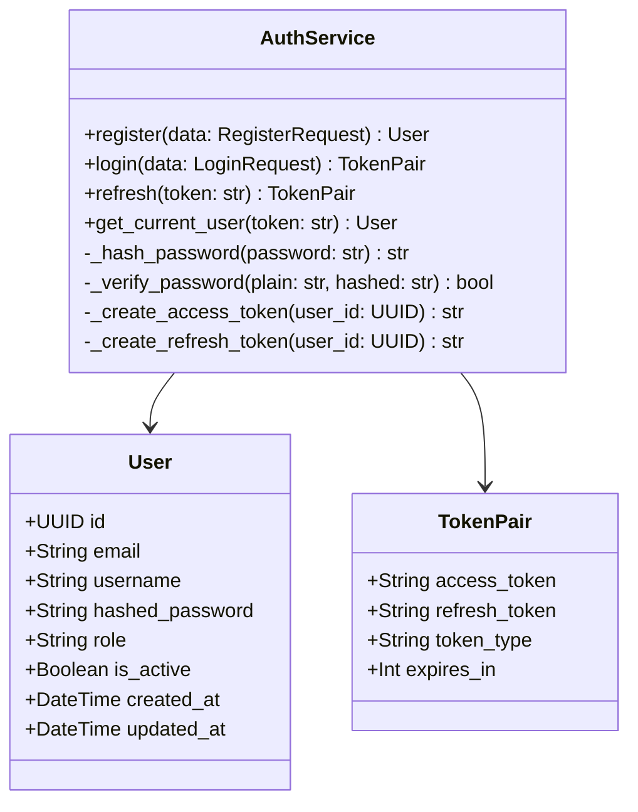
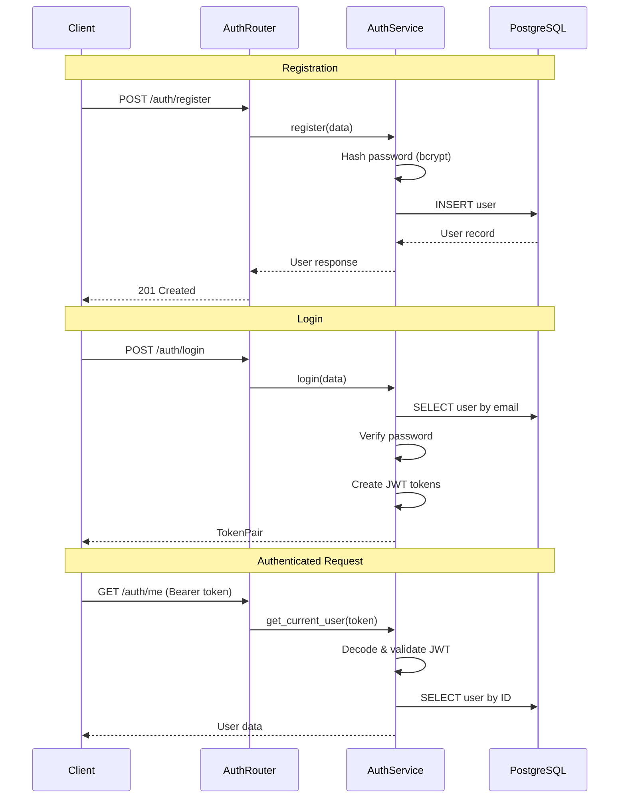
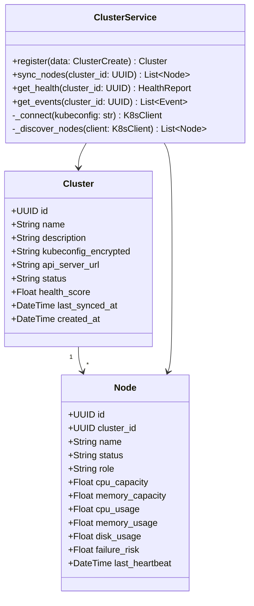
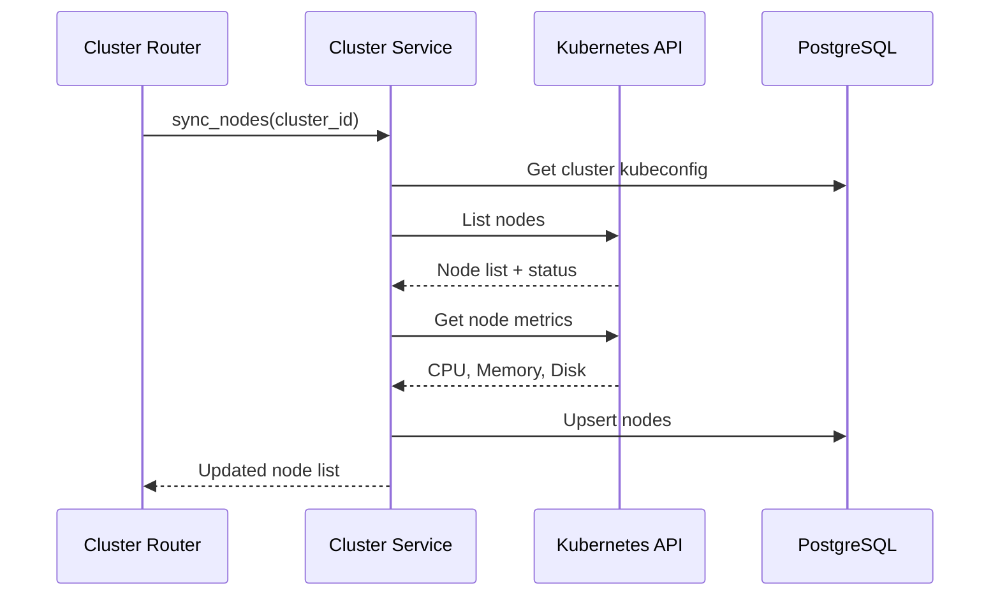
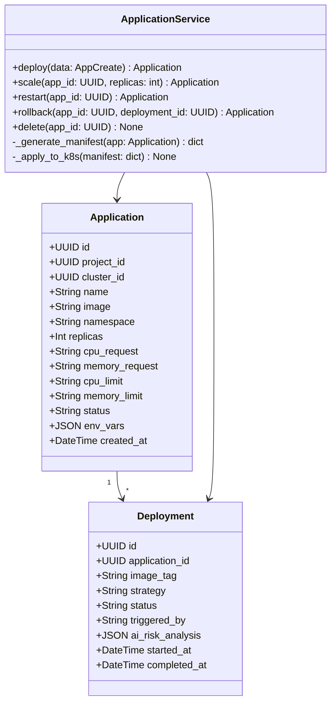
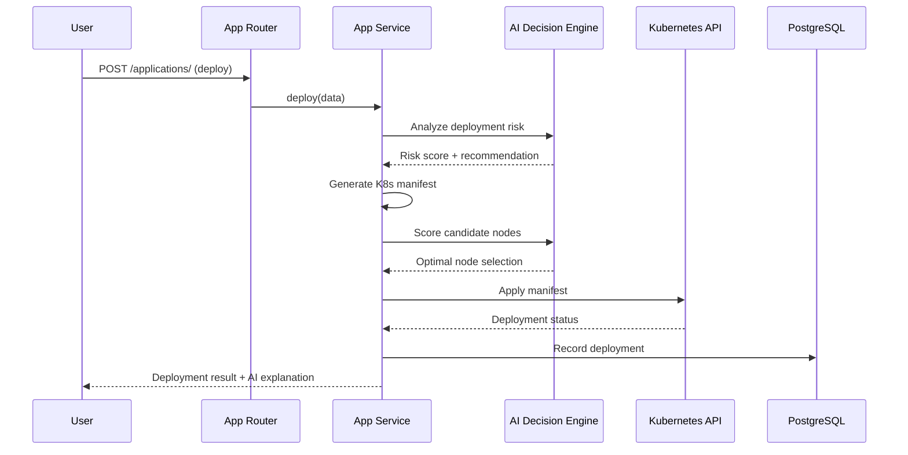
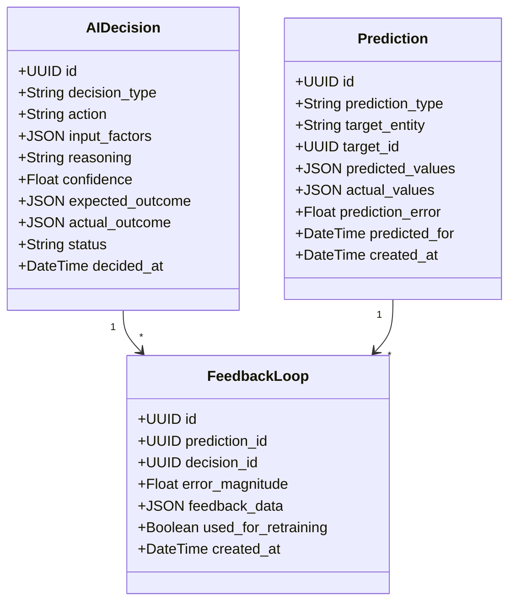

# KubeMind — Low-Level Design (LLD)

## Phase 1 Components

This LLD covers the detailed design for Phase 1: Authentication, Cluster Management, and Application Deployment.

---

## 1. Authentication Module

### 1.1 Class Diagram



### 1.2 Authentication Flow



### 1.3 JWT Token Structure

```json
{
  "sub": "user-uuid",
  "role": "developer",
  "exp": 1234567890,
  "iat": 1234567890,
  "type": "access"
}
```

### 1.4 RBAC Permission Matrix

| Action | Admin | Developer | Viewer |
|--------|-------|-----------|--------|
| Create project | ✅ | ✅ | ❌ |
| Delete project | ✅ | ❌ | ❌ |
| Deploy application | ✅ | ✅ | ❌ |
| View dashboard | ✅ | ✅ | ✅ |
| View AI decisions | ✅ | ✅ | ✅ |
| Manage users | ✅ | ❌ | ❌ |
| Register cluster | ✅ | ❌ | ❌ |
| View audit logs | ✅ | ❌ | ❌ |
| Trigger remediation | ✅ | ✅ | ❌ |

---

## 2. Cluster Management Module

### 2.1 Class Diagram



### 2.2 Node Discovery Flow



---

## 3. Application Deployment Module

### 3.1 Class Diagram



### 3.2 Deployment Flow



---

## 4. AI Decision Module

### 4.1 Class Diagram



---

## 5. API Contract Details

### 5.1 Error Response Format

```json
{
  "error": {
    "code": "VALIDATION_ERROR",
    "message": "Human-readable error message",
    "details": [
      {
        "field": "email",
        "message": "Invalid email format"
      }
    ]
  }
}
```

### 5.2 Pagination Format

```json
{
  "items": [...],
  "total": 100,
  "page": 1,
  "page_size": 20,
  "pages": 5
}
```

### 5.3 Standard HTTP Status Codes

| Code | Usage |
|------|-------|
| 200 | Success |
| 201 | Created |
| 204 | Deleted |
| 400 | Validation error |
| 401 | Unauthorized |
| 403 | Forbidden (insufficient role) |
| 404 | Not found |
| 409 | Conflict (duplicate) |
| 500 | Internal server error |

---

## 6. Database Indexes

| Table | Index | Type | Purpose |
|-------|-------|------|---------|
| `users` | `email` | UNIQUE | Login lookup |
| `users` | `username` | UNIQUE | Display name |
| `nodes` | `cluster_id` | B-tree | Cluster node listing |
| `applications` | `project_id` | B-tree | Project app listing |
| `deployments` | `application_id, started_at` | Composite | Deployment history |
| `ai_decisions` | `decided_at` | B-tree | Decision timeline |
| `predictions` | `predicted_for` | B-tree | Prediction lookup |
| `audit_logs` | `user_id, created_at` | Composite | Audit trail query |

---

## 7. Configuration Management

All configuration is managed through environment variables via Pydantic Settings:

```python
class Settings(BaseSettings):
    # Database
    postgres_host: str = "localhost"
    postgres_port: int = 5432
    postgres_db: str = "kubemind"
    postgres_user: str = "kubemind"
    postgres_password: str

    # Redis
    redis_host: str = "localhost"
    redis_port: int = 6379

    # JWT
    jwt_secret_key: str
    jwt_algorithm: str = "HS256"
    jwt_access_token_expire_minutes: int = 30
    jwt_refresh_token_expire_days: int = 7

    # Backend
    backend_host: str = "0.0.0.0"
    backend_port: int = 8000
    backend_debug: bool = False

    @property
    def database_url(self) -> str:
        return f"postgresql+asyncpg://{self.postgres_user}:{self.postgres_password}@{self.postgres_host}:{self.postgres_port}/{self.postgres_db}"

    model_config = SettingsConfigDict(env_file=".env")
```
