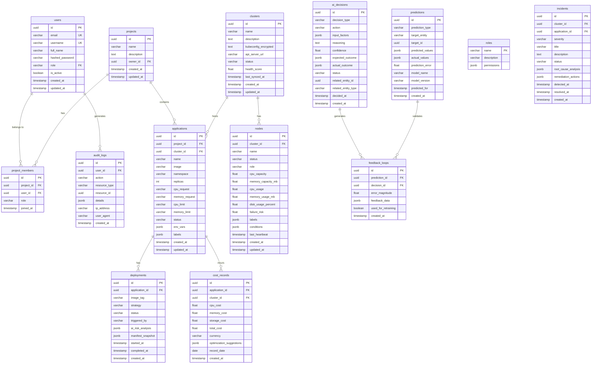

# KubeMind — Database Schema

## Entity Relationship Diagram



---

## Table Definitions

### `users`
Stores user accounts with authentication credentials and roles.

| Column | Type | Constraints | Description |
|--------|------|-------------|-------------|
| `id` | UUID | PK, DEFAULT gen_random_uuid() | Unique identifier |
| `email` | VARCHAR(255) | UNIQUE, NOT NULL | Login email |
| `username` | VARCHAR(100) | UNIQUE, NOT NULL | Display name |
| `full_name` | VARCHAR(255) | NOT NULL | Full name |
| `hashed_password` | VARCHAR(255) | NOT NULL | bcrypt hash |
| `role` | VARCHAR(50) | NOT NULL, DEFAULT 'developer' | FK to roles |
| `is_active` | BOOLEAN | DEFAULT true | Account status |
| `created_at` | TIMESTAMPTZ | DEFAULT NOW() | Creation time |
| `updated_at` | TIMESTAMPTZ | DEFAULT NOW() | Last update |

### `roles`
Defines available RBAC roles and their permissions.

| Column | Type | Constraints | Description |
|--------|------|-------------|-------------|
| `name` | VARCHAR(50) | PK | Role name (admin, developer, viewer) |
| `description` | TEXT | | Role description |
| `permissions` | JSONB | NOT NULL | Permission set |

**Seed Data:**
```sql
INSERT INTO roles (name, description, permissions) VALUES
('admin', 'Full system access', '{"clusters": ["read","write","delete"], "applications": ["read","write","delete"], "users": ["read","write","delete"], "audit": ["read"]}'),
('developer', 'Deploy and manage applications', '{"clusters": ["read"], "applications": ["read","write"], "users": ["read"], "audit": []}'),
('viewer', 'Read-only access', '{"clusters": ["read"], "applications": ["read"], "users": [], "audit": []}');
```

### `projects`
Project/workspace containers for organizing applications.

| Column | Type | Constraints | Description |
|--------|------|-------------|-------------|
| `id` | UUID | PK | Unique identifier |
| `name` | VARCHAR(255) | NOT NULL | Project name |
| `description` | TEXT | | Project description |
| `owner_id` | UUID | FK → users.id, NOT NULL | Project owner |
| `created_at` | TIMESTAMPTZ | DEFAULT NOW() | Creation time |
| `updated_at` | TIMESTAMPTZ | DEFAULT NOW() | Last update |

### `clusters`
Registered Kubernetes clusters.

| Column | Type | Constraints | Description |
|--------|------|-------------|-------------|
| `id` | UUID | PK | Unique identifier |
| `name` | VARCHAR(255) | NOT NULL | Cluster name |
| `description` | TEXT | | Cluster description |
| `kubeconfig_encrypted` | TEXT | NOT NULL | Encrypted kubeconfig |
| `api_server_url` | VARCHAR(500) | NOT NULL | API server endpoint |
| `status` | VARCHAR(50) | DEFAULT 'pending' | Connection status |
| `health_score` | FLOAT | | Overall health (0-100) |
| `last_synced_at` | TIMESTAMPTZ | | Last node sync |
| `created_at` | TIMESTAMPTZ | DEFAULT NOW() | Registration time |
| `updated_at` | TIMESTAMPTZ | DEFAULT NOW() | Last update |

### `nodes`
Discovered Kubernetes nodes with resource metrics.

| Column | Type | Constraints | Description |
|--------|------|-------------|-------------|
| `id` | UUID | PK | Unique identifier |
| `cluster_id` | UUID | FK → clusters.id, NOT NULL | Parent cluster |
| `name` | VARCHAR(255) | NOT NULL | Node name |
| `status` | VARCHAR(50) | | Ready/NotReady/Unknown |
| `role` | VARCHAR(50) | | control-plane/worker |
| `cpu_capacity` | FLOAT | | Total CPU cores |
| `memory_capacity_mb` | FLOAT | | Total memory in MB |
| `cpu_usage` | FLOAT | | Current CPU usage |
| `memory_usage_mb` | FLOAT | | Current memory usage |
| `disk_usage_percent` | FLOAT | | Disk utilization % |
| `failure_risk` | FLOAT | DEFAULT 0.0 | AI failure risk score |
| `labels` | JSONB | | K8s node labels |
| `conditions` | JSONB | | K8s node conditions |
| `last_heartbeat` | TIMESTAMPTZ | | Last health check |
| `created_at` | TIMESTAMPTZ | DEFAULT NOW() | Discovery time |
| `updated_at` | TIMESTAMPTZ | DEFAULT NOW() | Last update |

---

## Indexes

```sql
-- Users
CREATE UNIQUE INDEX idx_users_email ON users (email);
CREATE UNIQUE INDEX idx_users_username ON users (username);

-- Nodes
CREATE INDEX idx_nodes_cluster ON nodes (cluster_id);

-- Applications
CREATE INDEX idx_apps_project ON applications (project_id);
CREATE INDEX idx_apps_cluster ON applications (cluster_id);

-- Deployments
CREATE INDEX idx_deployments_app ON deployments (application_id);
CREATE INDEX idx_deployments_started ON deployments (application_id, started_at DESC);

-- AI Decisions
CREATE INDEX idx_ai_decisions_type ON ai_decisions (decision_type);
CREATE INDEX idx_ai_decisions_time ON ai_decisions (decided_at DESC);

-- Predictions
CREATE INDEX idx_predictions_type ON predictions (prediction_type);
CREATE INDEX idx_predictions_target ON predictions (target_entity, target_id);
CREATE INDEX idx_predictions_time ON predictions (predicted_for DESC);

-- Audit Logs
CREATE INDEX idx_audit_user ON audit_logs (user_id);
CREATE INDEX idx_audit_time ON audit_logs (created_at DESC);
CREATE INDEX idx_audit_user_time ON audit_logs (user_id, created_at DESC);

-- Incidents
CREATE INDEX idx_incidents_cluster ON incidents (cluster_id);
CREATE INDEX idx_incidents_severity ON incidents (severity, detected_at DESC);

-- Cost Records
CREATE INDEX idx_cost_app ON cost_records (application_id);
CREATE INDEX idx_cost_date ON cost_records (record_date DESC);
```
